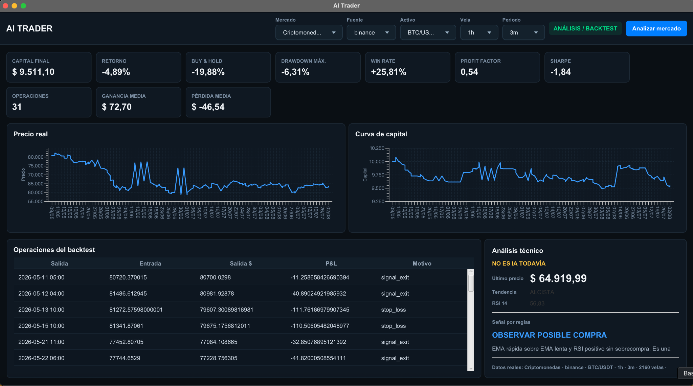

# AI Trader


**AI Trader** is an open-source multi-market platform for market analysis, strategy backtesting, risk evaluation and future machine-learning experimentation.

It combines a **JavaFX desktop application** with a **Python/FastAPI analytics engine** connected to real public market data for cryptocurrencies, stocks and ETFs.

> AI Trader is currently an educational, research and software-development project.  
> It does not provide financial advice and does not guarantee future results.

## Dashboard



## Current Features

### Cryptocurrencies

- BTC/USDT
- ETH/USDT
- Binance
- Kraken
- Public OHLCV market data through CCXT

### Stocks / ETFs

- Apple (`AAPL`)
- ASML (`ASML`)
- YPF ADR (`YPF`)
- SPDR S&P 500 ETF (`SPY`)
- Invesco QQQ (`QQQ`)
- Historical market data through Yahoo Finance / `yfinance`
- Stock/ETF search by ticker or company name with 300 ms autocomplete
- Search results with ticker, company name, exchange and company logo when available
- Selected stock displays its logo directly inside the asset control
- Stable top-toolbar layout when switching between crypto and stocks
- Clicking/focusing the asset field selects its text for fast replacement
- Initials are shown automatically when a logo is unavailable
- Intraday historical downloads split into date chunks for improved reliability
- Correct Unix-millisecond timestamp normalization across pandas/yfinance versions

### Timeframes and History

Supported candles:

- `1h`
- `4h`
- `1d`

Supported historical periods:

- 1 month
- 3 months
- 6 months
- 1 year

### Technical Analysis

- EMA 12
- EMA 26
- RSI 14
- ATR 14
- Rule-based technical signals
- Current trend evaluation

### Backtesting

- Historical strategy simulation
- Next-candle execution to reduce look-ahead bias
- Transaction fees
- Slippage simulation
- Position sizing
- Stop-loss
- Take-profit
- Conservative same-candle stop/take handling

### Performance Metrics

- Final capital
- Strategy return
- Buy & Hold return
- Maximum drawdown
- Win rate
- Profit factor
- Sharpe ratio
- Number of trades
- Average winning trade
- Average losing trade

### Desktop Interface

- JavaFX dashboard
- Real market price chart
- Equity curve
- Backtest operations table
- Technical-analysis panel
- Multi-market selector
- Exchange/data-source selector
- Timeframe selector
- Historical-period selector

## AI Status

The current version does **not yet use Machine Learning to generate trading signals**.

Signals are currently produced using explicit and explainable technical-analysis rules.

Machine Learning will be introduced only after the data pipeline, backtesting engine, risk controls and validation infrastructure are sufficiently mature.

The goal is not to treat AI as an oracle, but as another source of information that can be measured and validated against simpler strategies and benchmarks.

## Architecture

```text
┌──────────────────────────────┐
│       JavaFX Desktop         │
│                              │
│ Dashboard                    │
│ Charts                       │
│ Metrics                      │
│ Technical Signals            │
└──────────────┬───────────────┘
               │ HTTP / JSON
               ▼
┌──────────────────────────────┐
│       FastAPI Backend        │
│                              │
│ Market Data                  │
│ Indicators                   │
│ Backtesting                  │
│ Risk Metrics                 │
└──────────────┬───────────────┘
               │
          ┌────┴─────┐
          ▼          ▼
        CCXT      yfinance
          │          │
          ▼          ▼
       Crypto    Stocks / ETFs
```

## Technology Stack

### Desktop

- Java 21+
- JavaFX 23
- Maven
- Jackson

### Backend

- Python 3.11+
- FastAPI
- pandas
- NumPy
- CCXT
- yfinance

## Requirements

### Backend

- Python 3.11+
- `pip`

### Desktop

- Java 21+
- Maven

## Running the Backend

```bash
cd backend
python3 -m venv .venv
source .venv/bin/activate
python3 -m pip install -r requirements.txt
uvicorn src.api:app --reload --port 7000
```

Health check:

```bash
curl http://127.0.0.1:7000/health
```

FastAPI interactive documentation:

```text
http://127.0.0.1:7000/docs
```

## Running the Desktop

```bash
cd desktop
mvn clean javafx:run
```

## Example Stock Analysis

```text
Market: Acciones / ETF
Source: yahoo
Asset: AAPL
Timeframe: 1h
Period: 3m
```

## YPF Note

`YPF` currently represents the **YPF ADR traded in the United States**.

It does not currently represent the local BYMA instrument quoted in Argentine pesos. Support for Argentine local-market data is planned for a future stage.

## Market Data

Cryptocurrency data is obtained through public exchange endpoints using **CCXT**.

Stock and ETF data is obtained through **Yahoo Finance** using `yfinance`.

For intraday stocks, AI Trader downloads historical data in smaller date blocks and merges the results. This improves reliability when Yahoo Finance returns incomplete data for large intraday requests.

The current data sources are appropriate for research and backtesting, but should not be treated as institutional or execution-grade real-time feeds.

## Documentation

- [User Manual](docs/MANUAL.md)
- [Changelog](docs/CHANGELOG.md)

The user manual is written to be understandable even without previous trading experience.

## Roadmap

### Market Experience

- Universal crypto asset search
- Recently used assets and favorites
- More exchanges and market-data sources
- Argentine local-market data

### Strategies

- Multiple strategy engine
- Momentum
- Mean reversion
- Breakout
- Strategy comparison
- Market-regime detection

### Validation

- Out-of-sample testing
- Walk-forward validation
- Parameter robustness analysis

### Simulation

- Paper trading
- Open/closed simulated positions
- Portfolio tracking
- P&L history

### Artificial Intelligence

- Feature engineering
- Gradient Boosting / XGBoost experimentation
- Machine-learning signal models
- News analysis
- Sentiment analysis
- Explainable AI signals
- LSTM / Transformer experimentation

## Development Principles

1. Use real market data before predictive AI.
2. Risk management comes before automation.
3. Avoid look-ahead bias.
4. Include commissions and slippage.
5. Compare strategies against simple benchmarks.
6. Prefer explainable signals.
7. Validate results out of sample.
8. Paper trade before considering real capital.
9. Treat **NO TRADE** as a valid decision.
10. Never present backtest performance as guaranteed future performance.

## Disclaimer

AI Trader is provided for educational, research and software-development purposes.

Nothing in this project constitutes financial, investment or trading advice.

Financial markets involve risk. Historical performance does not guarantee future results.

## License

AI Trader is licensed under the **GNU General Public License v3.0 (GPL-3.0)**.


## Logo attribution

Stock and ETF logos in the asset search are provided by [Parqet](https://parqet.com/api).
When a logo is not available, AI Trader displays the asset initials instead.
